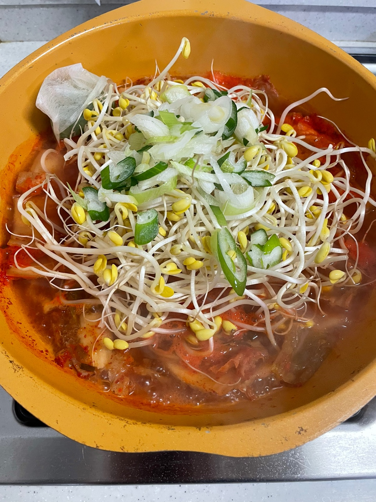

요리하는 개발자의 요리 일지 **"김치 콩나물국 편"**

요리를 단순 취미로 하고 있는 개발자의 기록이다.
성공한 레시피와 실패한 레시피 모두를 다루므로 요리 전문가의 글이 보고 싶다면 글의 가장 하단부의 참고한 자료에서 확인하도록 한다.

### 재료

필자는 재료에 적당히라는 표현을 많이 하는데 이미지를 첨부하므로 참고하길 바란다.

| |                  |
| --- |------------------|
| 북어 | 적당히              |
| 대파 | 1대               |
| 청양고추 | 4개               |
| 콩나물 | 300g             |
| 물 | 1.5L             |
| 가마솥 육수 캡슐 | 2개               |
| 김치 | 1/4 포기           |
| 새우젓 | 1 스푼 (베스킨라빈스 스푼) |
| 고추가루 | 3 스푼 (일반 수저)     |
| 국간장 | 2 스푼 (일반 수저)     |

**참고**

- 위의 레시피로 만들면 **신라면보다 매운**정도의 결과물이 만들어진다. 
  평소에 매운 것을 좋아하지 않는다면 청양고추와 고추가루의 양을 조절해야한다.

- 얼큰한 맛을 좋아하지만 청양고추가 씹히는 것을 싫어하여 청양고추를 다시팩에 넣고 끓이고 요리 완료 후 제거하였다.
 
- 육수를 만들기 위해 가마솥 육수 캡슐을 사용하였다. 다른 제품을 사용한다면 1.5L에 맞는 양을 넣어야한다.

---

### 조리법

1. 물 1.5L에 북어와 캡슐을 넣고 끓인다.

2. 물이 끓는 동안 콩나물을 세척한다.

3. 물이 끓기 시작하면 김치를 넣고 다시 한 번 끓여준다.

4. 김치가 충분히 익었으면 청양고추, 콩나물, 대파를 넣고 끓여준다.

5. 다시 물이 끓기시작하면 고추가루와 국간장을 넣어준다.

6. 간을 한 번보고 싱겁다면 새우젓을 넣어준다. (선택사항)

7. 10분간 콩나물의 숨이 죽을 때까지 끓여준다.

---

번외. 콩나물 국만 먹으면 허전하니까 사이드 메뉴로 햄도 하나 구워준다.

---

### 완성

사진은 생각보다 맛없게 나왔는데 실제로는 맛있었다.

### 평가

육수를 직접 만드는 것이 아니라 시제품을 사용한다면 생각보다 간단하게 만들 수 있다.
해장용으로 좋을듯하며 콩나물의 양을 조금 줄이고 두부를 넣어도 맛있을 듯하다.

---

참고한 자료: https://blog.naver.com/baby0817/222652527093?isInf=true