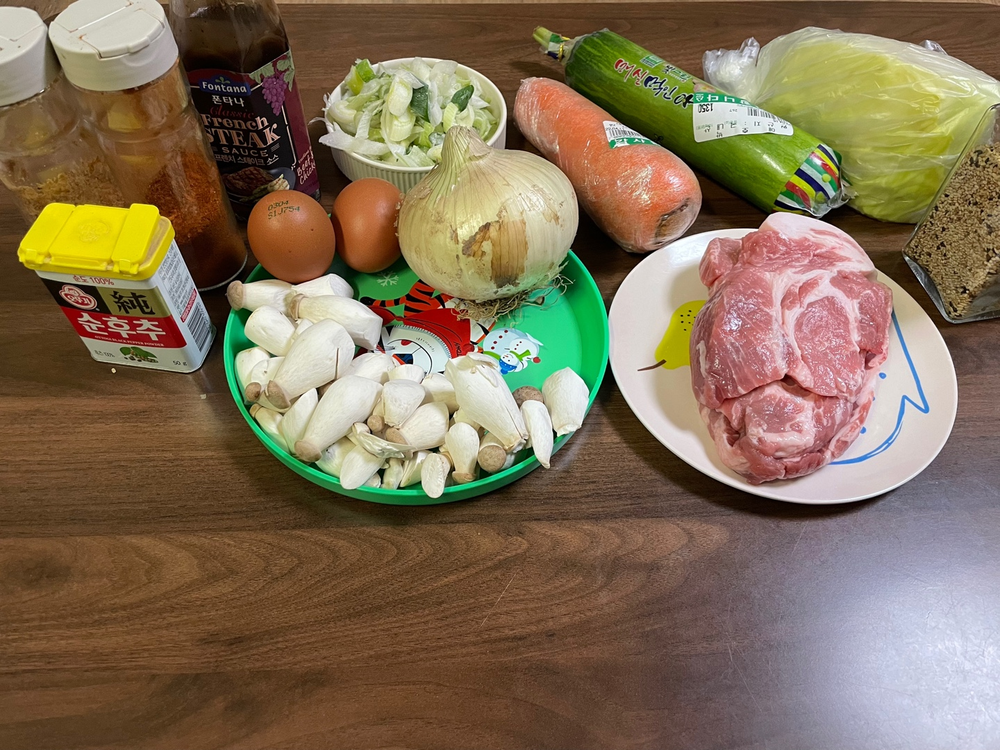
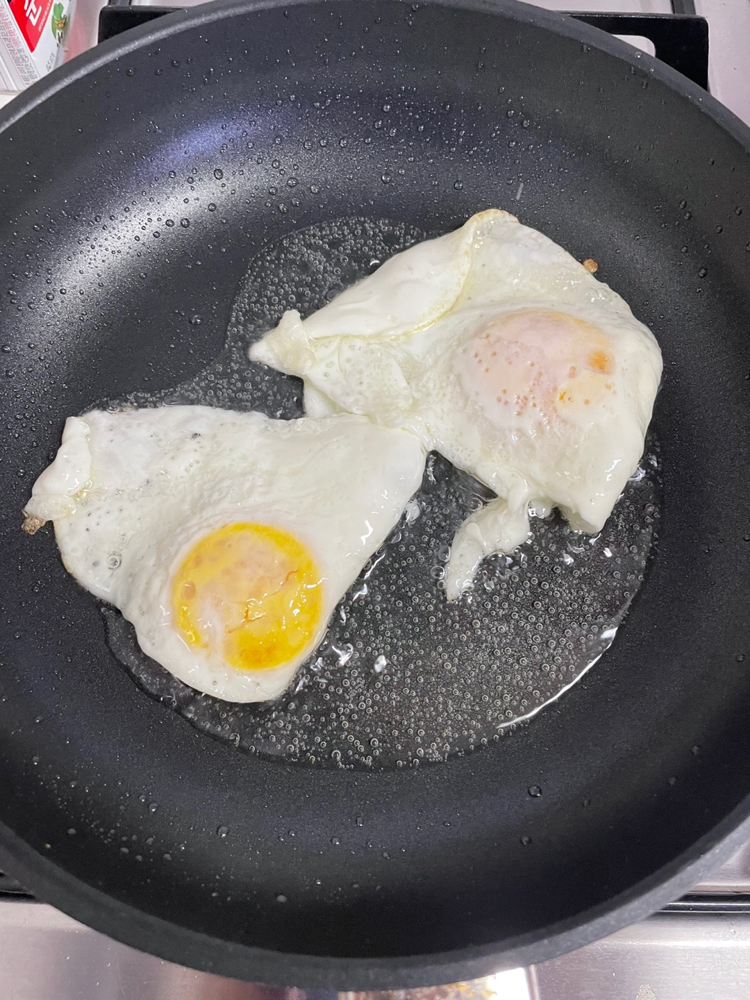
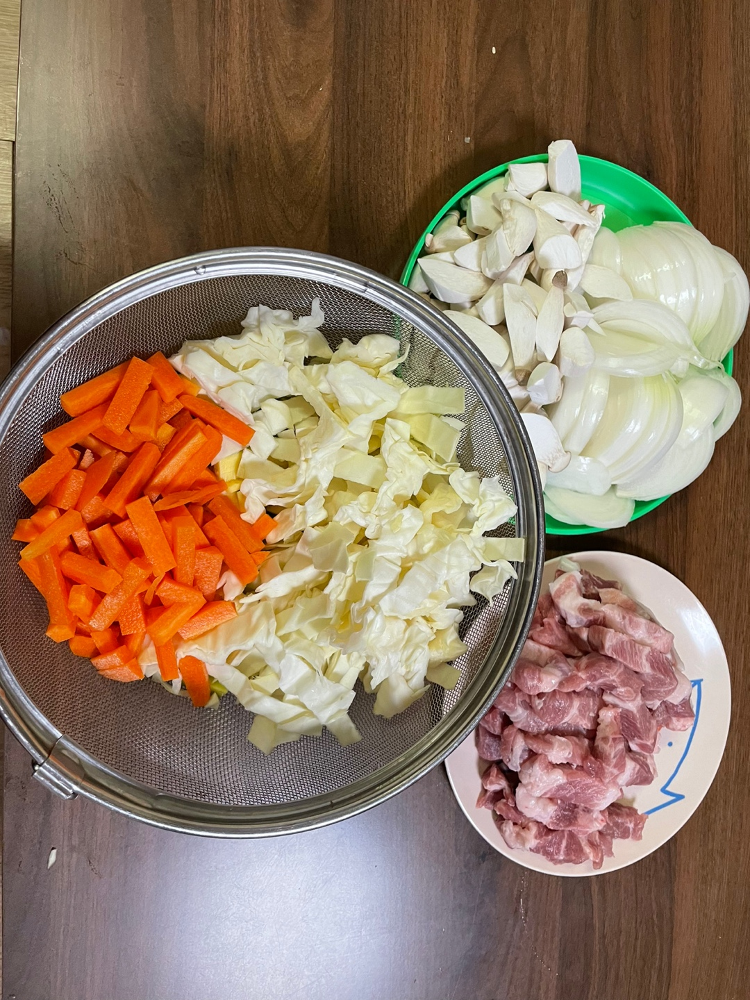
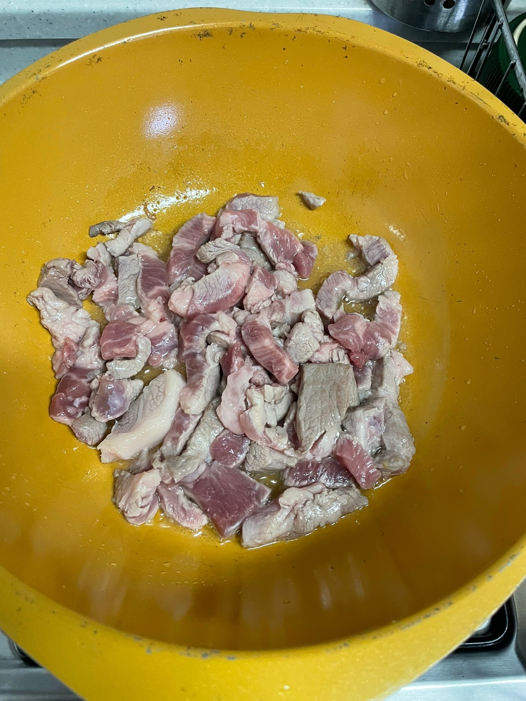
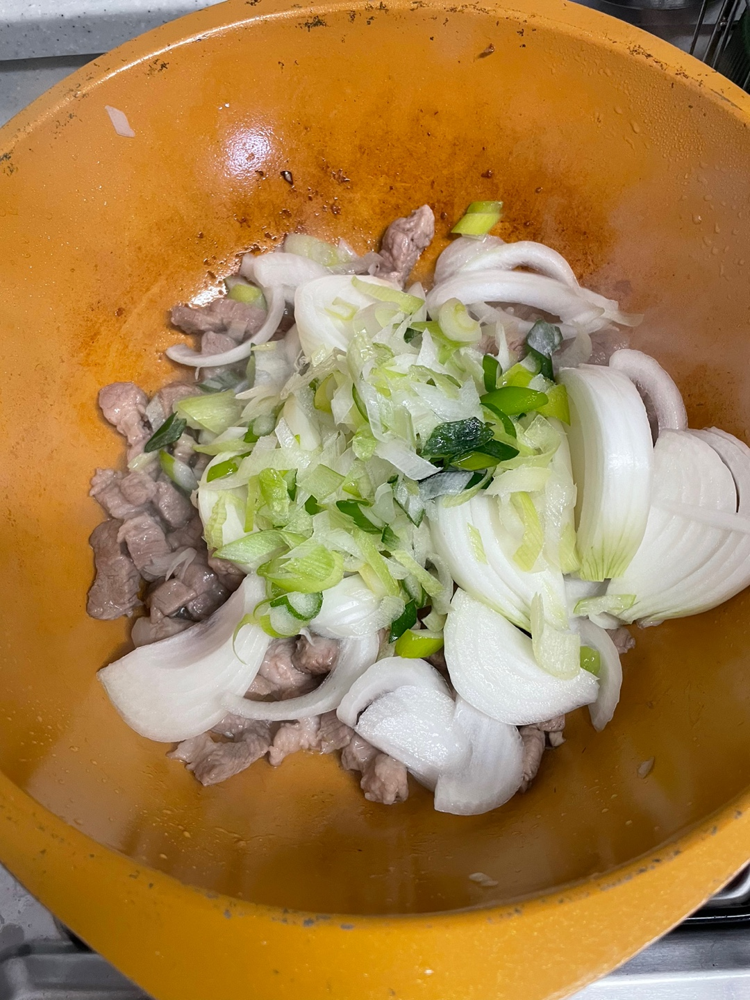
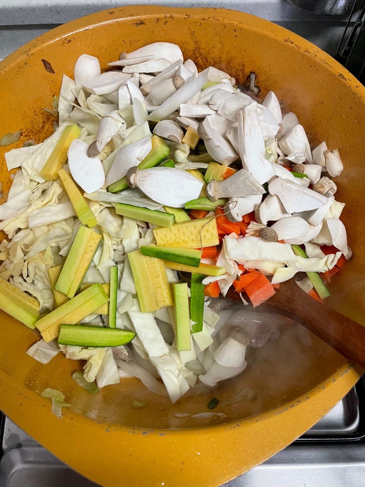
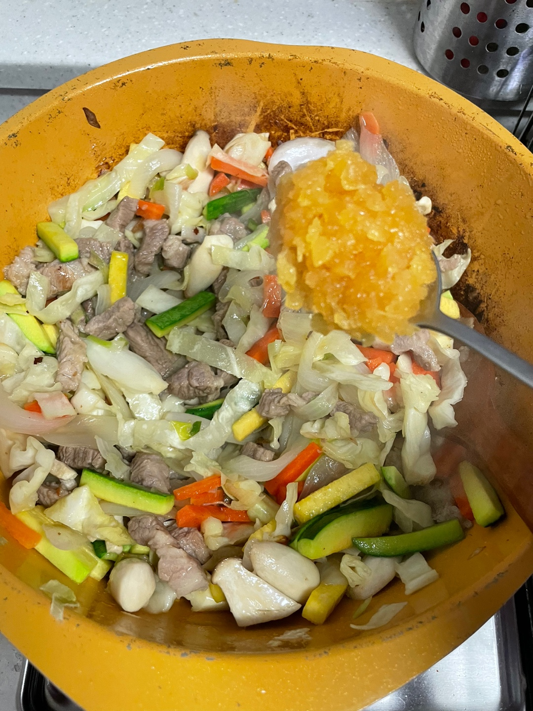
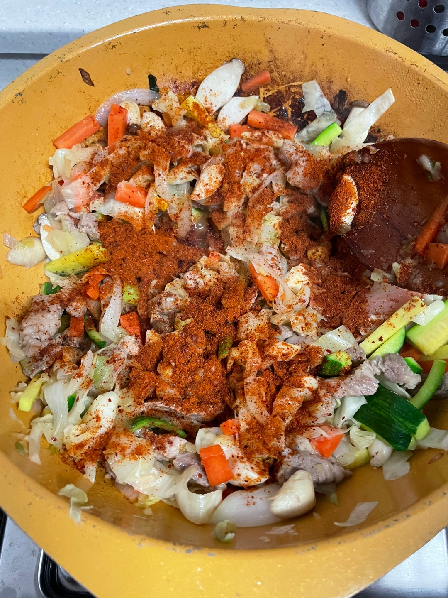
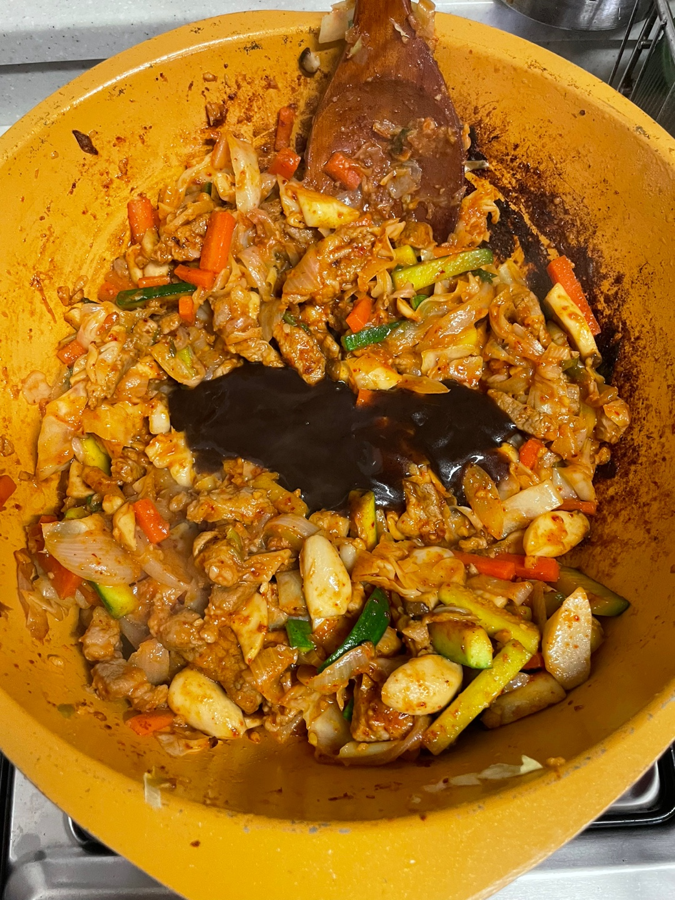
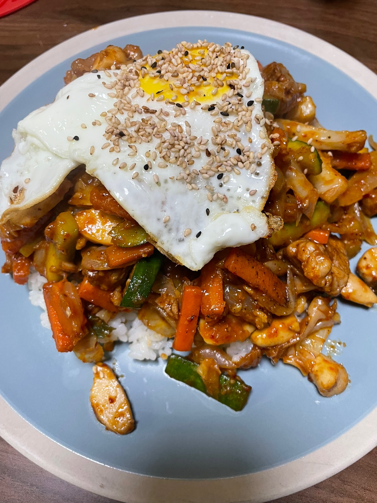

요리하는 개발자의 요리 일지 **"중화비빔밥(대구식) 편"**

요리를 단순 취미로 하고 있는 개발자의 기록이다.
성공한 레시피와 실패한 레시피 모두를 다루므로 요리 전문가의 글이 보고 싶다면 글의 가장 하단부의 참고한 자료에서 확인하도록 한다.

### 재료

필자는 재료에 적당히라는 표현을 많이 사용하는데 이미지를 첨부하므로 참고하길 바란다.

| 재료 | 양 |
| -- | -- |
| 목살 | 400g |
| 참깨 | 적당량 |
| 양배추 | 적당량 |
| 애호박 | 적당량 |
| 당근 | 적당량 |
| 양파 | 큰거 한개 |
| 대파 | 한대 |
| 계란 | 두개 |
| 꼬마새송이버섯 | 적당량 |
| 스테이크 소스 | 4 스푼 (일반 스푼) |
| 고추가루 | 4 스푼 (일반 스푼) |
| 다시다 | 1/2 스푼 |
| 후추 | 적당량 |
| 다진마늘 | 1스푼 반 (일반 스푼) |

**참고**

- 재료는 2인분을 기준으로 작성하였다.

- 만드는 도중 빨간색이 옅어서 고추가루를 8스푼 정도 넣었다. (이로인해 글을 쓰는 지금도 속이 쓰리다. 색이 나오지 않더라도 4스푼에서 멈추는게 좋다.)

- 고기는 목살말고 돼지의 어느 부위를 사용해도 된다.

- 꼬마새송이버섯은 남는게 있어서 추가하였다. 없으면 생략해도 좋다.

---

### 조리법

**1. 완성된 비빔밥위에 올릴 계란후라이를 먼저 만들어준다.**

**2. 재료들을 먹기 좋은 크기로 손질한다.**

**3. 후라이팬에 식용유를 세 스푼정도 뿌리고 고기를 구워준다.**
이때 고기는 집어서 먹을 수 있을 정도로 구워야한다.

**4. 고기가 충분히 익었으면 양파와 대파를 넣고 양파가 숨이 죽을 때 까지 볶아준다.**

**5. 양파가 충분히 숨이 죽었으면 양배추와 다른 야채들을 넣어준다.**
야채가 숨이 죽을 때 까지 오래 볶아준다.
비빔밥을 먹을 때 야채 씹히는 식감을 좋아하면 적당히 볶아주면 된다.

**6. 야채를 충분히 볶았으면 다진마늘과 고추가루를 넣어준다.**
고추가루가 타지 않게 빠르게 30초 정도 섞으면서 볶아준다.

**7. 고추가루가 재료들에 잘 버무려졌으면 스테이크 소스를 넣어준다.**

**8. 재료들에 스테이크 소스가 잘 버무려졌으면 완성.** 

---

### 완성

### 평가

사실 이번 중화비빔밥 시도는 실패했다. 필자도 필자의 여자친구도 음식을 남겼다.
빨간색을 내기위해 고추가루를 많이 넣어서 너무 매워서 먹기가 쉽지 않았다.
스테이크 소스를 넣으니까 시큼한 맛이 났다. 오히려 돈가스 소스를 넣었으면 달콤한 맛이 매운맛도 잡아줘서 좋았을듯 하다.

---

참고한 자료: https://www.youtube.com/watch?v=vBEmBcC2stc&ab_channel=%EC%9E%90%EC%B7%A8%EC%9A%94%EB%A6%AC%EC%8B%A0simplecooking