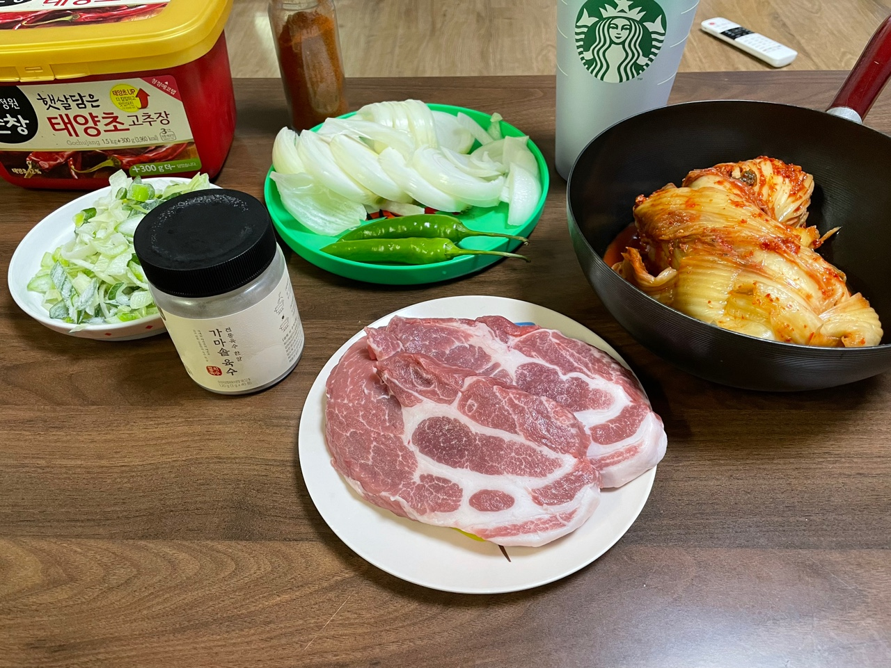
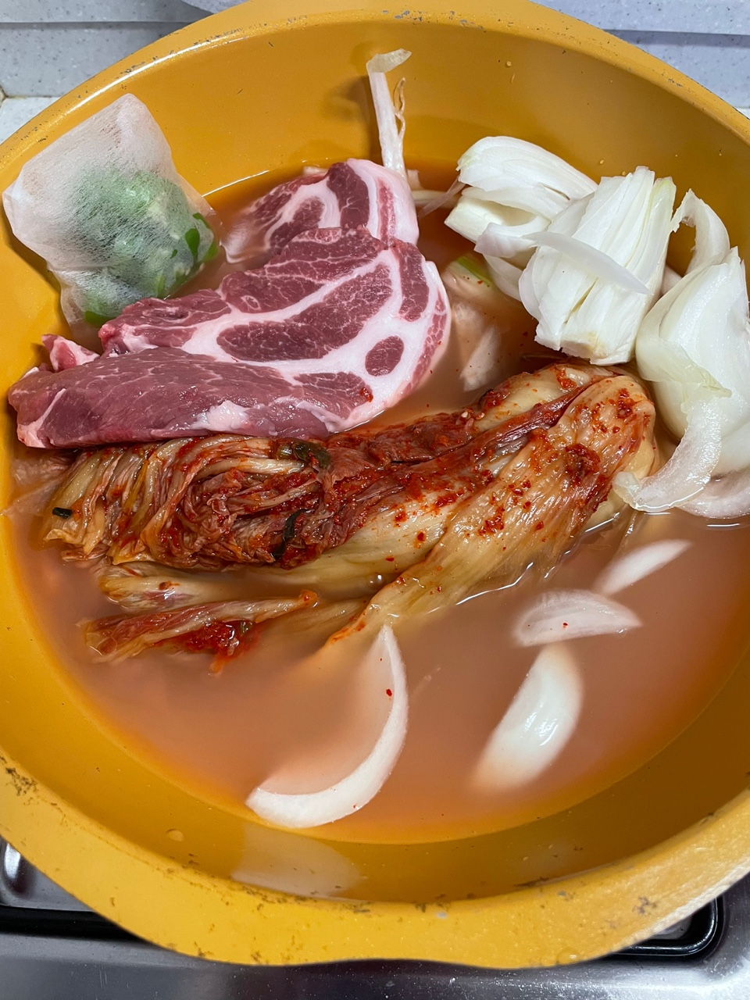
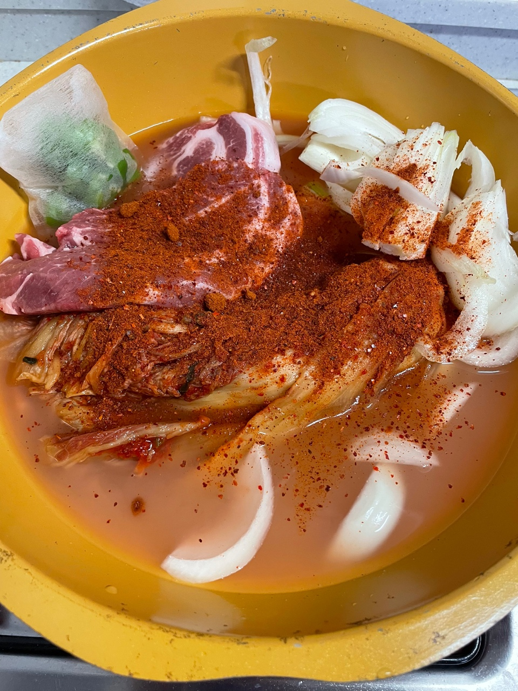
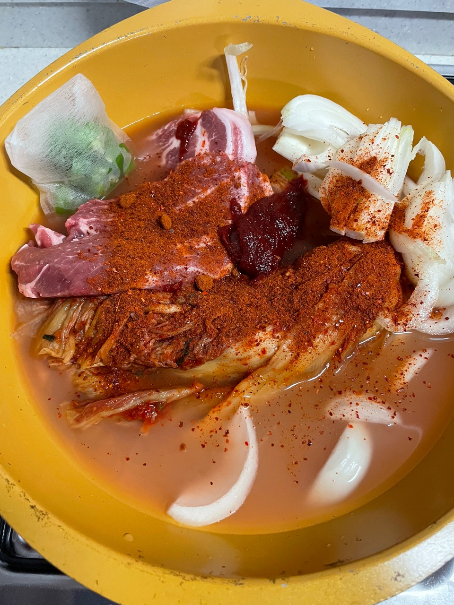
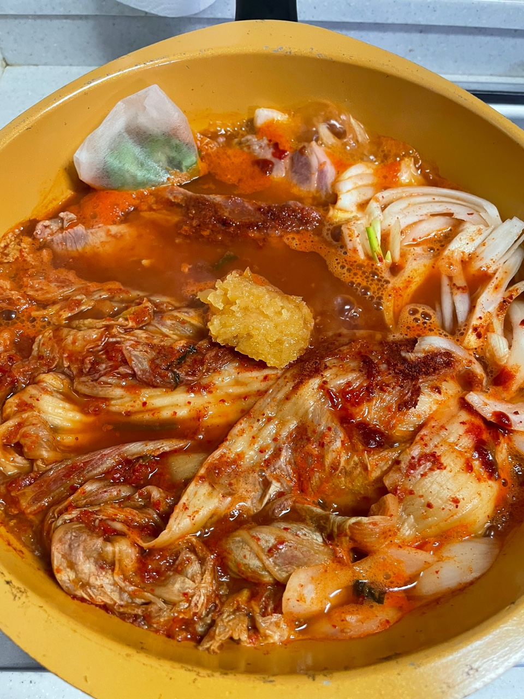
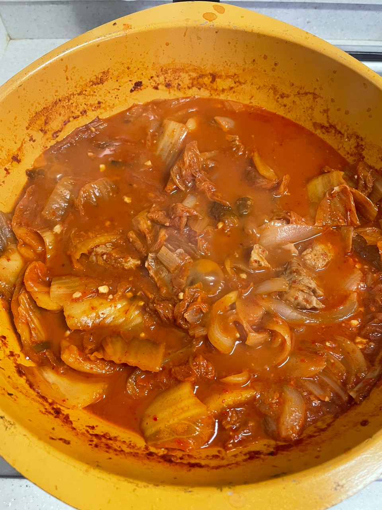
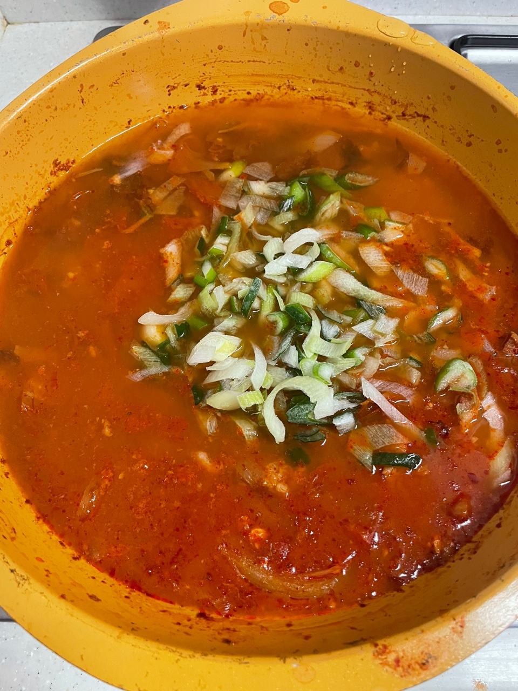
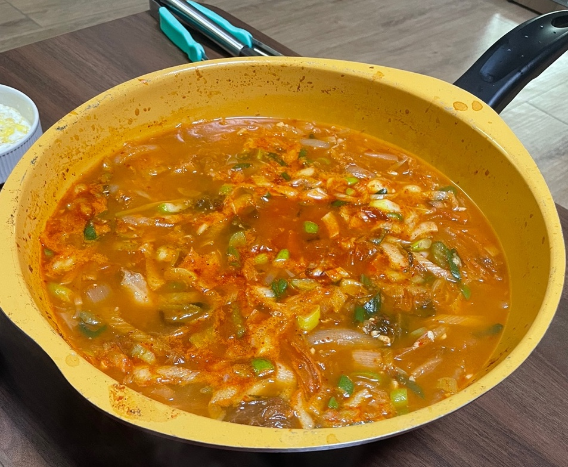

요리하는 개발자의 요리 일지 **"묵은지 목살 김치찌개 편"**

요리를 단순 취미로 하고 있는 개발자의 기록이다.
성공한 레시피와 실패한 레시피 모두를 다루므로 요리 전문가의 글이 보고 싶다면 글의 가장 하단부의 참고한 자료에서 확인하도록 한다.

### 재료

필자는 재료에 적당히라는 표현을 많이 하는데 이미지를 첨부하므로 참고하길 바란다.

|  |  |
| -- | -- |
| 묵은지 | 반 포기 |
| 목살 | 400g |
| 양파 | 1/2개 |
| 대파 | 1대 |
| 청양고추 | 2개 |
| 고추장 | 1스푼 (일반스푼) |
| 고추가루 | 2스푼 |
| 다진마늘 | 1스푼 |
| 쌀뜨물 | 적당히 |
| 가마솥 육수 캡슐 | 1개 |

**참고**

- 위의 레시피로 만들면 **신라면보다 매운**정도의 결과물이 만들어진다.
  평소에 매운 것을 좋아하지 않는다면 청양고추와 고추가루의 양을 조절해야한다.
- 스타벅스 텀블러에는 쌀뜨물이 담겨있다. 쌀뜨물과 함께라면 더 맛있는 김치찌개가 만들어진다.
- 홍고추는 없어서 추가하지 못했다. 맛에는 큰 영향이 없지만 이쁜 음식을 좋아한다면 추가하는 것이 좋다.

---

### 조리법

**1. 끓이기 시작**
목살, 양파, 김치, 청양고추, 육수 캡슐, 쌀뜨물을 넣고 끓여준다.
이때 들어간 양의 물이 최종 결과물의 양은 아니므로 재료가 전부 잠길정도만 넣어주면 된다.

**2. 고추가루와 고추장 추가**

**고추가루**

**고추장**

**3. 다진마늘 추가**
물이 어느정도 끓기 시작하면 다진마늘을 추가해준다.

**4. 김치 풀죽이기**
3단계까지 완료하고 20 ~ 30분정도 있으면 아래의 이미지처럼 물이 많이 줄어든다.
10분정도 불을 끄고 뚜껑을 닫아서 김치가 먹기 좋은 식감이 되도록 숨을 죽인다.

**5. 물, 대파 추가**
김치가 어느정도 숨이 죽었으면 대파와 물을 추가로 넣고 끓여준다.
물은 간을 보면서 적당량을 추가해야한다. 필자는 200ml정도 추가하였다.

---

### 완성

사진을 잘 못찍는건지... 맛없게 나왔는데 생각보다 맛있었다.

---

### 평가

김치 베이스 요리는 김치가 90%인 듯 하다. 김치가 맛있어서 성공적인 김치찌개를 만들 수 있었다.
필자는 김치찌개를 먹을 때 김치가 흐물흐물한 것이 좋아서 오래 끓이고 10분간 숨을 죽이는 과정을 추가하였다.
아삭아삭한 김치찌개를 원한다면 끓이는 시간과 숨을 죽이는 시간을 조절해야한다.

---

참고한 자료: https://blog.naver.com/lafleur7/222471953125