요리하는 개발자의 요리 일지 **"순두부찌개 편"**

요리를 단순 취미로 하고 있는 개발자의 기록이다.
성공한 레시피와 실패한 레시피 모두를 다루므로 요리 전문가의 글이 보고 싶다면 글의 가장 하단부의 참고한 자료에서 확인하도록 한다.

### 재료

필자는 재료에 적당히라는 표현을 많이 하는데 이미지를 첨부하므로 참고하길 바란다.

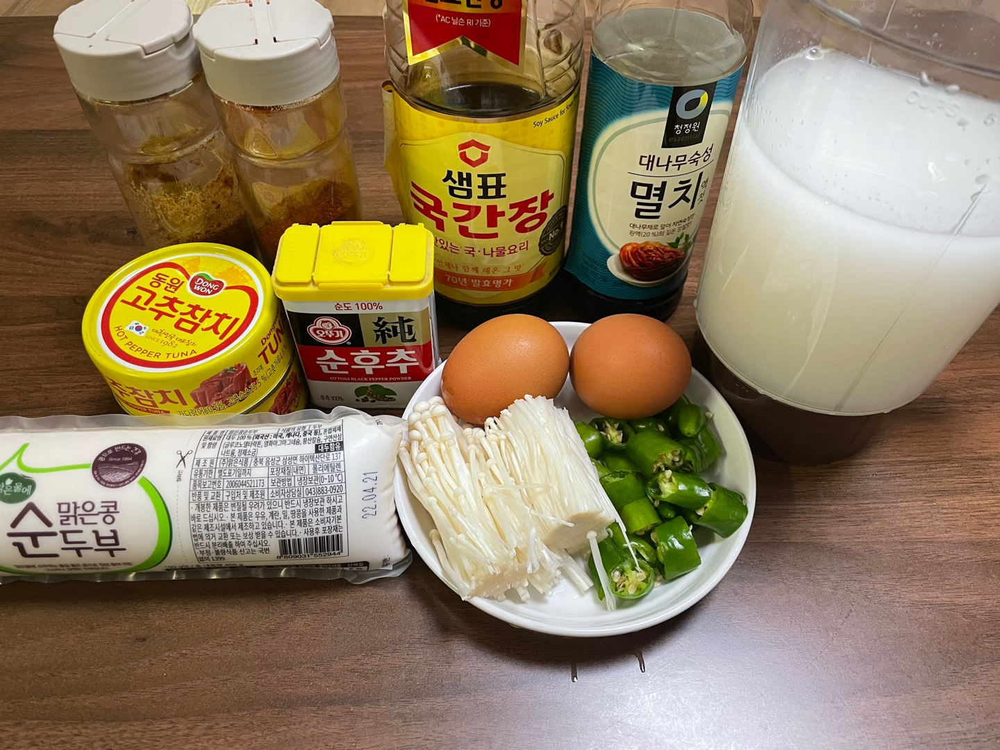

|  |  |
| -- | -- |
| 쌀뜨물 | 760ml |
| 순두부 | 1개 |
| 고추참치 | 2캔 |
| 청양고추 | 4개 |
| 팽이버섯 | 반봉지 |
| 고추가루 | 2스푼 (일반 스푼) |
| 다시다 | 1/2스푼 (일반 스푼) | 
| 후추 | 1/3스푼 (일반 스푼) |
| 계란 | 2개 |
| 국간장 | 4스푼 (일반 스푼) |
| 멸치액젓 | 2스푼 (일반 스푼) |
| 간마늘 | 1스푼 반 (일반 스푼) |

**참고**

- 재료는 2인분을 기준으로 준비되었다. 1인분은 재료에서 1/2하면 된다.
- 완성하고 보니 순두부 1봉지는 조금 적다는 생각이 든다. 순두부를 좋아한다면 2봉지를 넣는 것을 추천한다.
- 팽이버섯도 완성되고 보니 양이 너무 적었다. 한봉지를 전부 넣는 것을 추천한다.
- 필자는 요리 중간에 청양고추를 빼기위해 크게 썰었다. 중간에 빼지않고 같이 먹을 것이라면 더 작게 써는 것을 추천한다.
- 쌀뜨물이 없다면 일반 물을 사용해도 무관하다.
- 필자가 적어놓은 레시피로 조리하면 **"신라면보다 맵고 불닭볶음면 보다는 덜 매운정도"** 로 완성된다. 
  고추가루와 청양고추의 양을 자신의 입맛에 맞게 유동적으로 변경해야한다.

---

### 조리법

**1. 쌀뜨물을 넣고 약불로 끓여준다. 초반에 넣을 재료가 많아서 다 넣을 때까지만 약불로 끓여준다.**

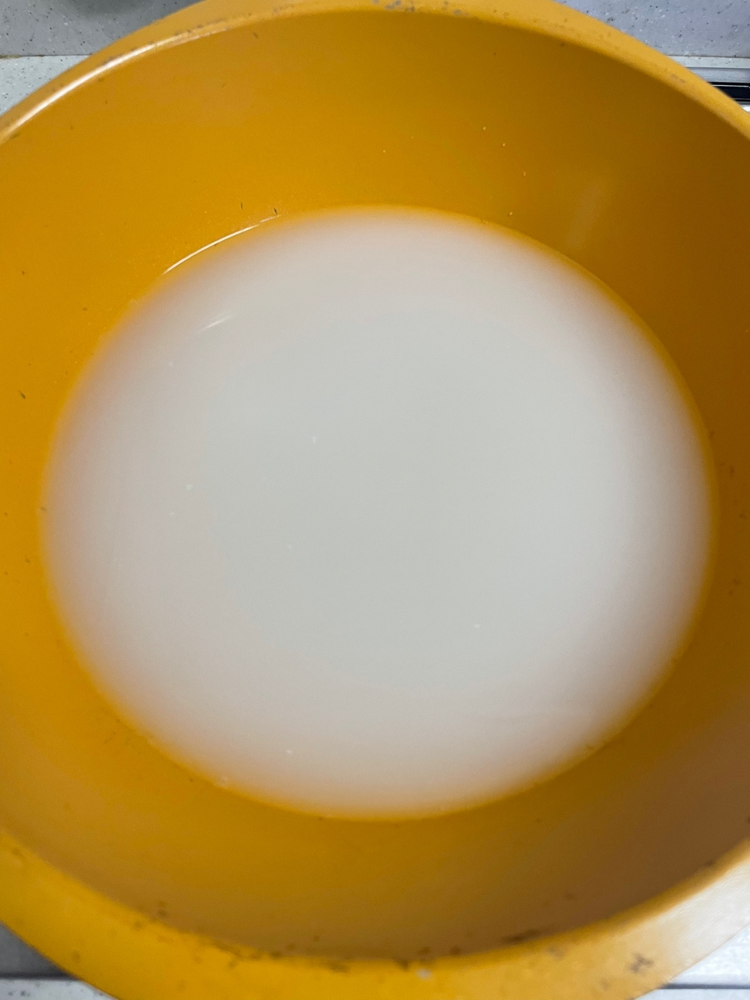

**2. 고추참치를 넣어준다.**

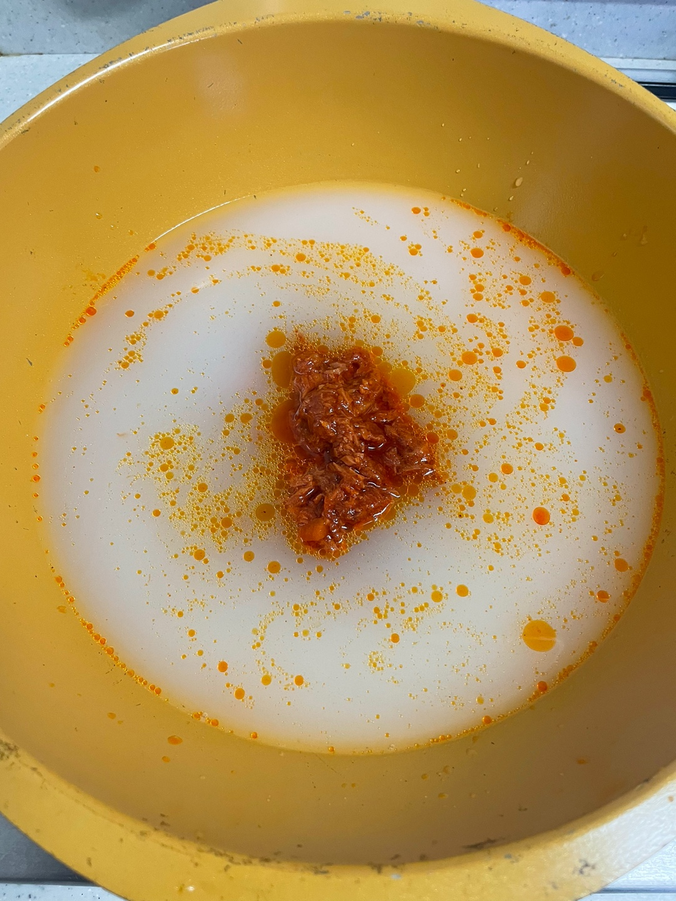

**3. 청양고추를 넣어준다. 필자는 조리 중간에 뺄 예정이므로 망에 담아서 넣었다.**

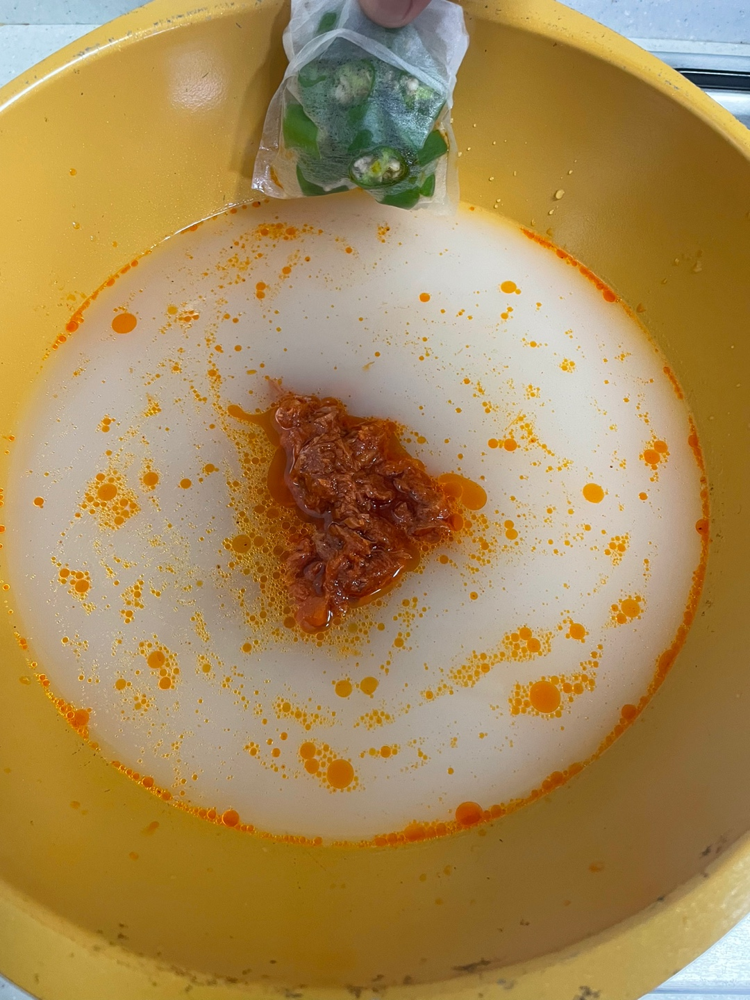

**4. 고추가루를 2스푼 넣어준다. 매운거 못먹으면 1스푼으로 조절한다.**

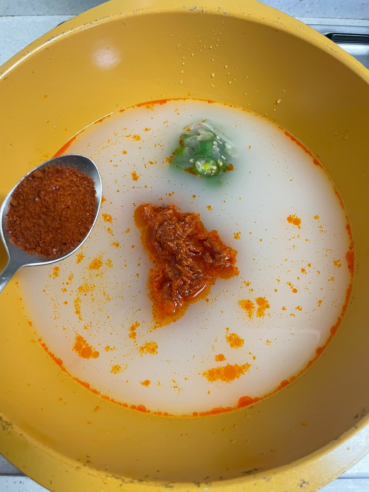

**5. 간마늘 한스푼 반 투하**

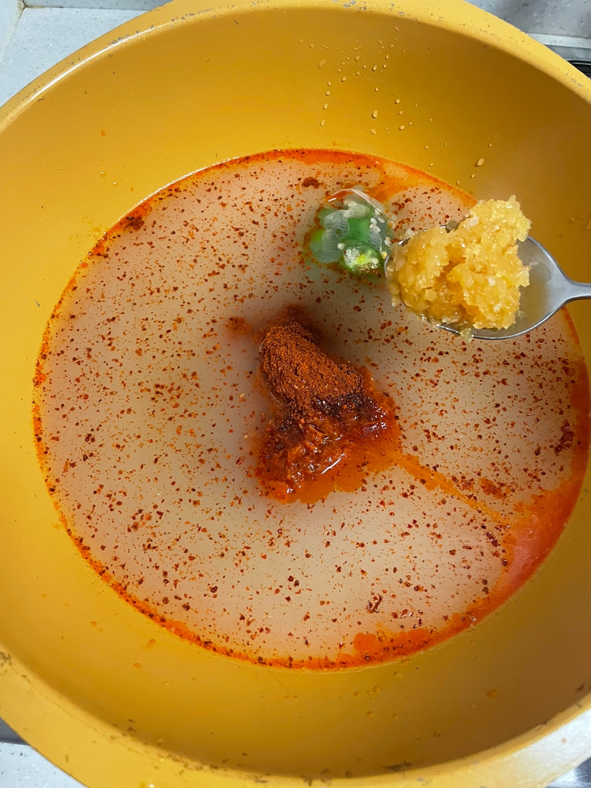

**6. 국간장 4스푼 투하. 평소에 싱겁게 먹는 스타일이라면 2스푼만 넣고 요리 완성시점에 추가로 넣는 것을 추천한다.**

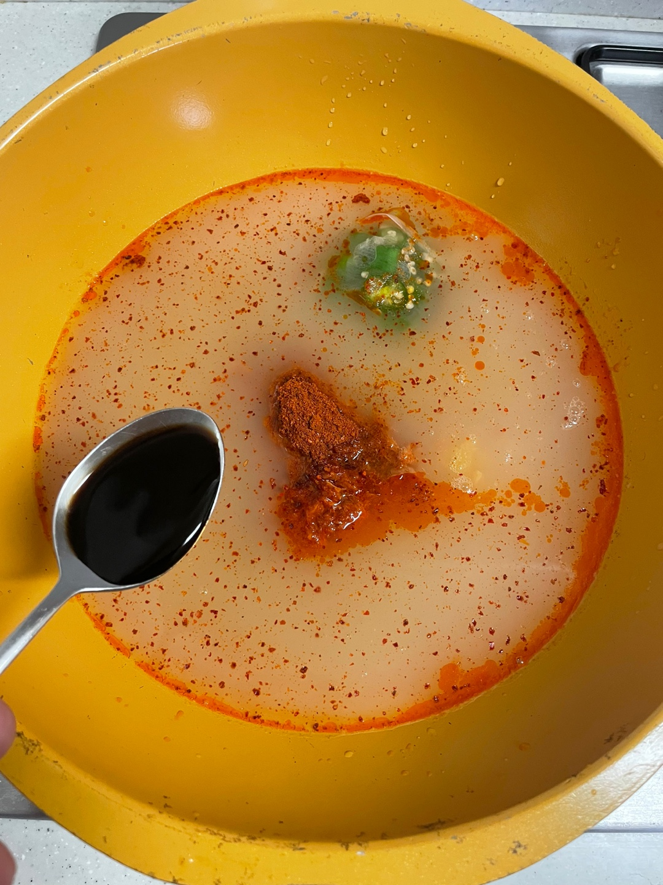

**7. 멸치액젓 2스푼 투하. 국간장과 동일하게 입맛에 맞게 양을 조절한다.**
**초반에 넣어야하는 재료는 다 넣었으므로 쎈불에서 끓여준다.**

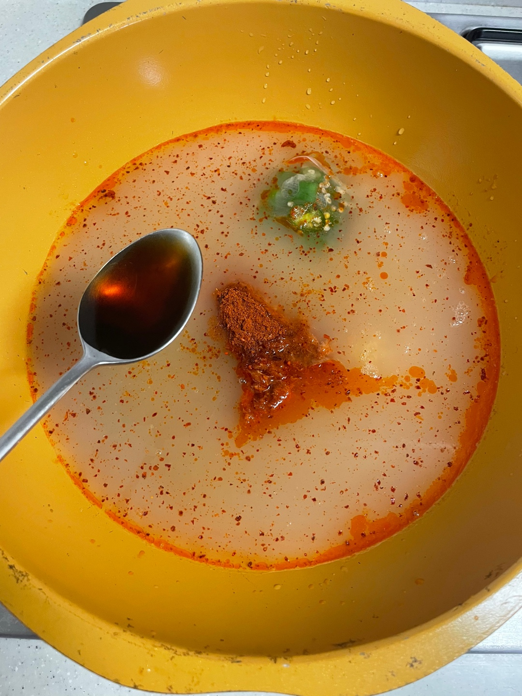

**8. 물이 끓기 시작하면 순두부를 넣고 먹기 좋은 크기로 잘라준다.**

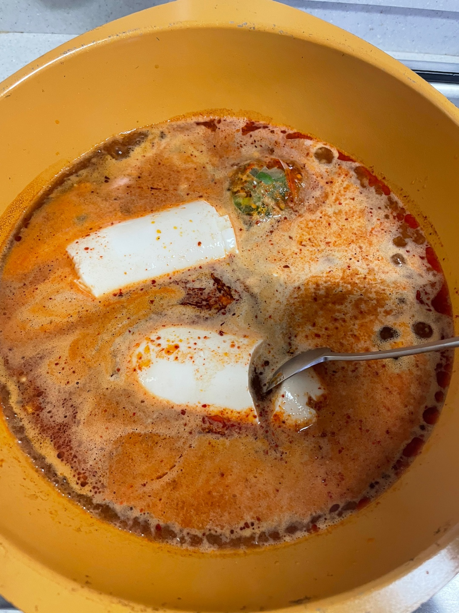

**9. 팽이버섯을 넣어준다.**

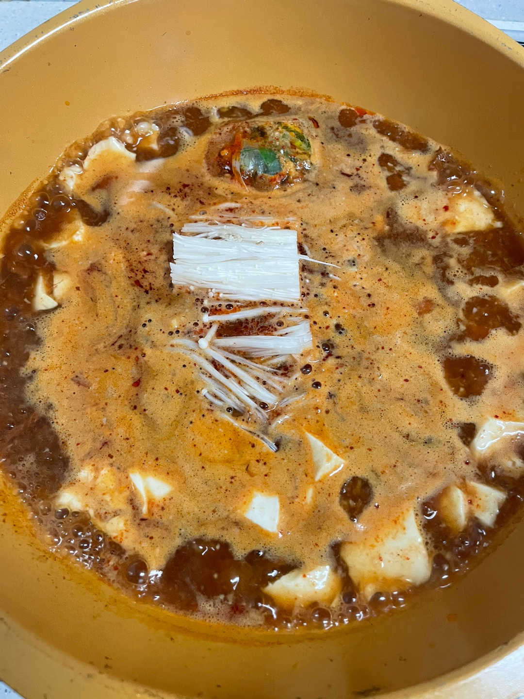

**10. 다시다 1/2스푼을 넣어준다. 넣기 전에 간보고 필요없다고 판단되면 생략가능.**

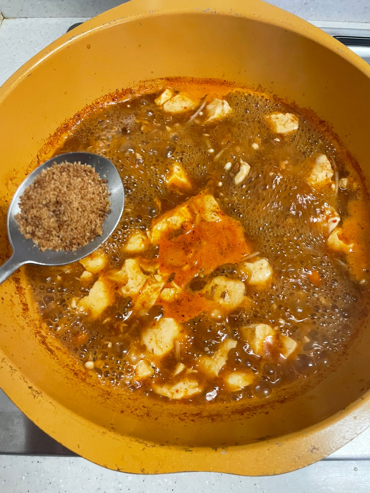

**11. 후추 1/3스푼 넣어준다. 필자는 1/3스푼을 넣었으나 1/5 스푼 정도 넣는 것을 추천한다.**
**1/3스푼 넣으면 완성되었을 때 후추향이 매우 강하게 난다.**

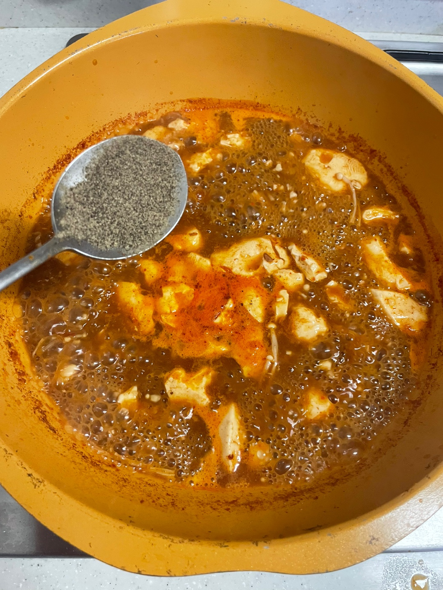

**12. 적당히 끓으면 대파를 넣고 마무리한다. (생략 가능)**

---

### 완성

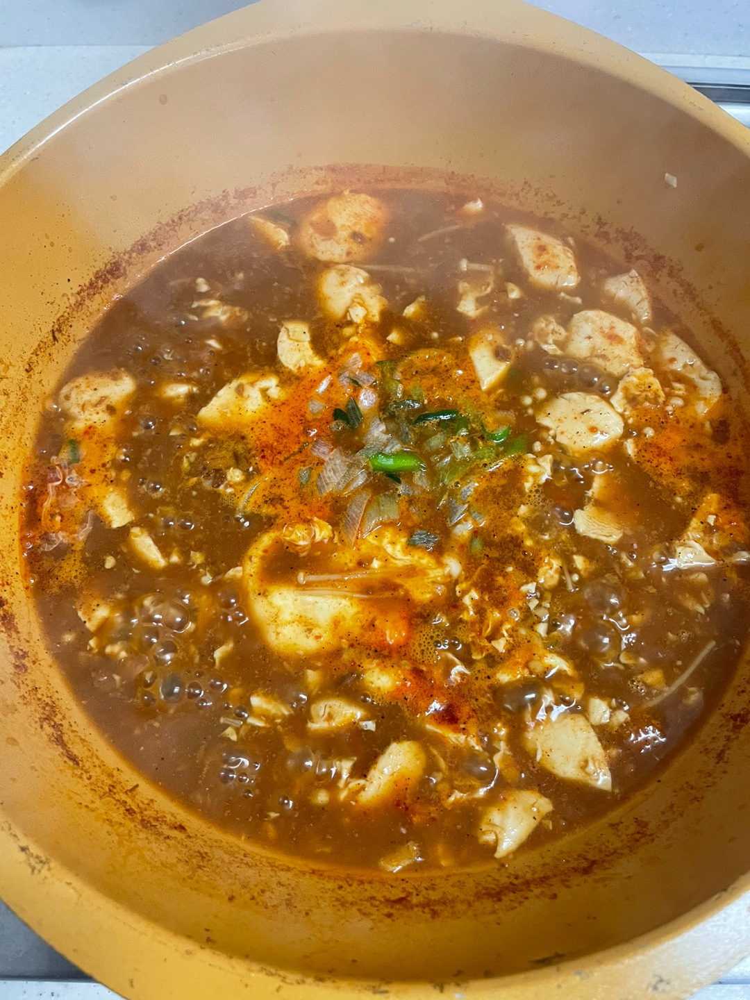

---

### 평가

정말 맛있는 식당에서 먹는 순두부찌개 맛이 난다. 대기업의 고추참치 맛이 요리를 한층 맛있게 완성시켜 주었다.
청양고추를 많이 넣어 생각보다 상당히 매웠다. 맛있게 매웠으니 만족한다.
정말 간편하게 맛있는 순두부찌개를 만들 수 있었다.
요리하기 귀찮은 사람들에게 추천한다.

---

참고한 자료: https://www.youtube.com/shorts/qO7w5UyPZgk?&ab_channel=%EA%BE%B8%EC%82%90KUPI