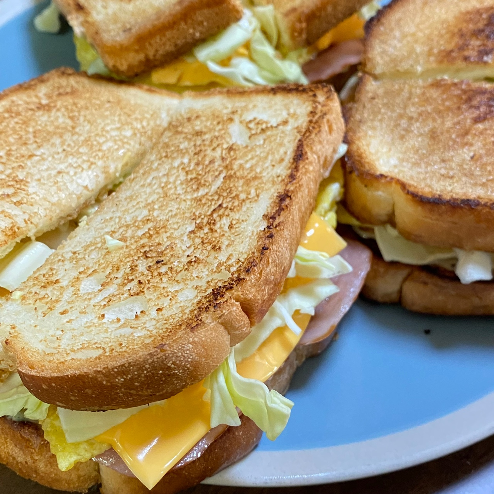

요리하는 개발자의 요리 일지 **"이삭 토스트 편"**

요리를 단순 취미로 하고 있는 개발자의 기록이다.
성공한 레시피와 실패한 레시피 모두를 다루므로 요리 전문가의 글이 보고 싶다면 글의 가장 하단부의 참고한 자료에서 확인하도록 한다.

### 재료

필자는 재료에 적당히라는 표현을 많이 하는데 이미지를 첨부하므로 참고하길 바란다.

|  |  |
| -- | -- |
| 키위 드레싱 | 2스푼 (일반 스푼) |
| 마요네즈 | 2스푼 (일반 스푼) |
| 설탕 | 1스푼 (일반 스푼) |
| 치즈 | 1장 |
| 햄 | 4장 |
| 계란 | 1.3개 |
| 빵 | 2장 |
| 버터 | 2블럭 |
| 양배추 | 적당히 |

**참고**

- 양배추를 제외한 모든 재료는 토스트 한 개를 만들기 위한 재료다.
- 필자의 경우 백설탕이 없어서 흑설탕을 사용했지만 백설탕이 있다면 백설탕을 사용한다.
- 양배추는 잘게 썰수록 만들기도 먹기도 편하다.
- 계란은 토스트 한 개당 하나면 충분하다.
- 필자가 사용한 의성마늘 햄의 경우 사이즈가 작기 때문에 4장이나 들어갔지만 사용하는 햄의 양의 크기에 따라서 양을 조절해야한다.

---

### 조리법

**1. 소스 만들기**
토스트 한 개 기준으로 키위 드레싱 2스푼, 마요네즈 2스푼, 설탕 1스푼을 섞어서 소스를 만들어준다.
두 개를 만든다면 키위 드레싱 2 * 2스푼, 마요네즈 2 * 2스푼, 설탕 1 * 2스푼을 섞어서 만들면 된다.

**2. 약불로 후라이팬에 버터 한 블럭을 올리고 전부 녹여준다.**

**3. 버터가 전부 녹으면 빵을 올려서 바삭하게 구워준다.**

**4. 빵이 완성되면 재료를 하나씩 올려서 토스트 모양을 만들어준다.**

---

### 완성

### 평가

생각보다 맛있었지만 이삭 토스트의 단맛은 나지 않았다. 소스를 충분히 만들어서 많이 발라주면 더 이삭토스트 맛이 날듯하다.
버터를 녹이고 빵을 굽는 과정이 상당히 손이 많이 간다. 버터를 포기하고 토스트기를 이용하는 것도 좋은 방법이다.
서두르면 버터가 전부 타서 시커먼 빵을 맞이하게 된다. 완성된 사진에서 검은 토스트가 버터가 타서 그렇다.

---

참고한 자료: https://www.youtube.com/shorts/IuBhY4pd9X4?&ab_channel=%EB%94%94%EA%B8%80%3ADiggle